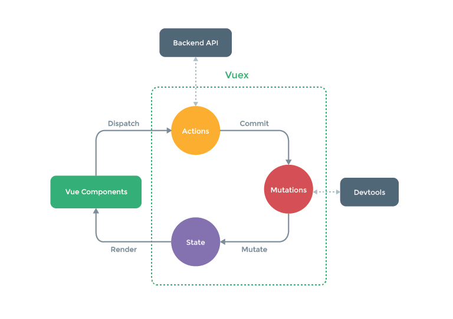

# Vuex

Vuex는 Vue의 대표적인 상태관리 라이브러리입니다.

React와 달리 Vue는 프레임워크를 표방한만큼 상태관리 라이브러리도 직접 만들어서 제공해주었습니다. 기존의 상태 관리 라이브러리와 마찬가지로 Vuex 또한 Flux 패턴에 기반하여 만들어진 상태 관리 라이브러리입니다.

Vuex에서 특이한 점은 Flux, Redux와 달리 Action 과 State 사이에 Mutation이라는 별도의 과정이 있다는 점입니다. 공식 가이드는 다음과 같이 가이드 하고 있습니다.

Flux에 익숙한 사람들이라면, Action이 Dispatcher에 의해 Store의 값을 변화시키고, 이 값을 구독하고 있는 View로 하여금 변화하게 한다는 걸 알고 있습니다. 그럼 Vuex에서 말하는 Mutation이 Dispatch와 같은 의미일까요? 그렇지 않습니다. Mutation은 Vuex만이 갖고 있는 특이한 프로세스입니다.

이 부분을 좀 더 다루기 전에 dispatch가 뭔지에 대해서 정의하고 지나가겠습니다. Dispatch란 CS용어로 어떤 메소드를 호출할 것인지 결정하여 그것을 실행하는 과정입니다. 일반적인 함수 실행과 구분되는 것은 액션명을 통해 어떤 메소드를 호출할지 결정한다는 점입니다. redux 혹은 flux에 익숙한 분들은 아시겠지만, 간단하게 아래와 같이 표현됩니다.

```jsx
case ACTION_A:
	// code
case ACTION_B:
	// code
```

그렇다면 Mutation은 무엇일까요? Mutation의 내부를 보면 Mutation은 상태값을 직접 조작합니다. 왜 이 동작을 Action에서 수행하면 안되는걸까요? 이는 여러가지 이유가 있을 수 있지만, 순전히 devtools 때문입니다. vuex의 devtool은 mutation 실행 시 이전과 이후를 추적합니다.

devtool의 github을 보시면 아시겠지만, vue-devtools는 chrome extentsion이자 또 하나의 vue app입니다. 내부 코드를 보면, Bridge라고 부르는 EventEmitter를 상속한 객체를 생성하여, Vuex와 devtools를 연결짓습니다. 그리고 Vue.prototype 객체 내에 SharedData라는 값을 주입시켜, 해당 객체의 변화를 추적합니다. 두 앱은 postMessage를 통해 통신하며 값이 변경될 때 노티합니다. (이하 생략..)



전역 상태 관리에 있어서 devtools의 유무는 중요한 부분입니다. 눈에 보이지 않는 부분의 변화를 수반하기 때문입니다. 여하튼, Vuex는 위와 같은 방식으로 동작하며, 비동기에 관한 작업을 Actions에서 동기적인 작업을 Mutation에서 처리합니다.

그럼 질문이 생길 수 있습니다. 도식도를 보면 Action은 commit을 통해 Mutation을 호출합니다. 그런데 Vuex 가이드에선 mapMutation 헬퍼 함수를 통해 Mutation을 Vue Component 내에서 사용할 수 있다라고 가이드합니다. 그럼 우리는 Mutation과 Action을 어떻게 사용해야할까요?

여러가지로 사용할 수 있다는 건 자유도가 높아보이지만 실상을 그렇게 편리하지 않은 법입니다. 도식도에 맞추어 패턴에 맞춰서 Action → Mutation을 호출하도록 만들 수도 있고, Mutation만을 호출하도록 만들 수 있으니까요. 또한 이러한 형태가 가능하다면 비동기를 굳이 Action에서 처리할 필요 없이, 컴포넌트나 기타 모듈에서 처리한 후 Mutation을 호출하게 된다면 동일한 동작이 됩니다. 

Vuex에 이러한 점은 개발 시 여러가지 잡음을 발생시켰으며, 현재도 Vuex로 개발된 프로젝트들을 보면 Action, Mutation 등의 사용 용도가 제각각인 경우가 많습니다. Vuex를 사용한다면, 어떤 방법으로 사용할지 하나의 방법만을 정해서 실행하는 것을 추천합니다.

이러한 논란을 종식시키기 위해서, Vuex 5 RFC 그리고 Pinia에서는 Mutiation을 제거하였습니다. Vuex 5 RFC는 다음과 같은 간단한 5가지 항목을 명시합니다.

> - 2 syntax support for the store creation, options api, and composition api.
> - No mutations. Only state, getters, and actions.
> - No nested modules. Only stores. Compose them instead.
> - Complete TypeScript support.
> - Transparent, automated code splitting.

현재 Vuex 4 페이지에 들어가면, Vuex는 Pinia가 Vuex 5 RFC를 달성하고 있다면서, 공식 상태 관리 라이브러리로 간주하고 있음을 볼 수 있습니다. if you're planning to start a new project, we highly recommend using Pinia instead. 라는 문구와 함께 말이죠.

mutation을 써야하는 이유를 Vuex 1~4까지 주구장창 주장해왔음에도 이렇게 변경하는 이유는 무엇일까요? 논의된 사례들과 현업에서 일어나는 프론트엔드 환경의 변화를 볼 때 그 이유는 분명합니다. Composition API의 도입입니다. Composition API는 React의 hook과 항시 비교되는 Vue의 함수형 API입니다. Vue 3, 즉 Composition API 출시 이후로 Vue 진영은 Vue 3 전용 Vuex에 대한 필요 기능을 요구 받아왔습니다. 왜냐하면 state → action → mutations → state 로 이어지는 Vuex 모듈의 결합도가 강해, 단순한 합성 기능으로 쉽게 로직을 분리할 수 있다라고 주장하는 Composition API와 걸맞지 않았기 때문입니다.

결국 Vuex는 5, 즉 Pinia에서, 개별 값에 분리해서 접근할 수 있고, 개별 메서드(액션)에 분리하여 접근할 수 있게 만들어버립니다.

참고 - [https://github.com/kiaking/rfcs/blob/vuex-5/active-rfcs/0000-vuex-5.md](https://github.com/kiaking/rfcs/blob/vuex-5/active-rfcs/0000-vuex-5.md)
